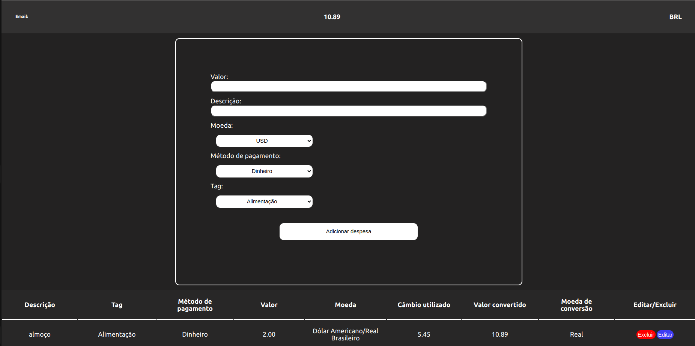

<h1 align="center">Wallet</h1>

<h4>Glossário</h4>

- O que é esse projeto? E o que é possivel fazer?
- Tecnologias Utilizadas
- Como rodar o projeto no seu computador?
- Como rodar os testes?
- App em Funcionamento

## Onde acessar a aplicação?
Caso queira acessar a aplicação, você pode inserir no campo de email qualquer email(desde que esteja em um formato válido de email. Ex: `example@gmail.com`) e uma senha com pelo menos 8 caracteres. Acesse [aqui](https://wallet-seven-kappa.vercel.app/)

## O que é esse projeto? E o que é possivel fazer?

**Esta aplicação é uma carteira de controle de gastos com conversor de moedas. Ao utilizar essa aplicação, a pessoa usuária deverá ser capaz de: Adicionar, remover e editar um gasto. Visualizar sua tabela de gastos. Visualizar o total de gastos convertidos para uma moeda de sua escolha.**

## Tecnologias Utilizadas:

<div align="center">


</div>

## Como rodar o projeto no seu computador?

**Para rodar o projeto localmente, siga estes passos:**

Clone o projeto

```bash
# Com SSH
$ git clone git@github.com:joseVitor03/project-wallet.git

# Com HTTP
$ git clone https://github.com/joseVitor03/project-wallet.git
```

Para rodar o projeto, instale as dependências primeiro:

```bash
$ npm install
```
```bash
$ npm run dev
```

## Como rodar os testes?

```bash
$ npm run test
```

## App em funcionamento:

<div align="center">

</div>